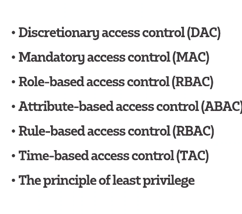

# Access Control

## Access control models
    
* DAC 
    * Lets a selected amount of uses accesses i.e your PC OS
* MAC 
    * Assigns security level to file only lets people with that level (or higher) view the file 
* RBAC
    * Based on the individuals role and the responsible within the organisation
* ABAC
    * Control the resource (attribute) based of the environmental factors such as time
* RBAC
    * Set of rule regarding the conditions of the access list i.e ACL
* TAC

* The principle of the least privilege
    * Grant the user the very minimum access right to complete the task  
### AAA Framework
  Users necessary framework to allow correct access 
* Authentication
    * Users and Admin must prove that they are who they say they are
* Authorisation
    * Determine which resources the user can access and which operations the user is allowed to perform
* Accounting
    * Records exactly what the user does, and including what is accessed, and any changes that are made 
### AAA Architecture
* Local AAA Authentication
    * This method is mainly used for a smaller networks, know as self container authentication because it authenticates user against locally stored Usernames and Pass
*   Server-based AAA authentication
    * LDUB conects to the AAA server
    * this method authenticates against a central AAA server that contains the username adn password for all users
### AAA Protocol
* RADIUS
    * Protocol that supports centralised authenetication, authorisation and accounting management for clients that establish connection with a network 
* TACACS
    * older protocol that was used on UNIX 
* TACACS +
  * released by CISCO to replace RADIUS 