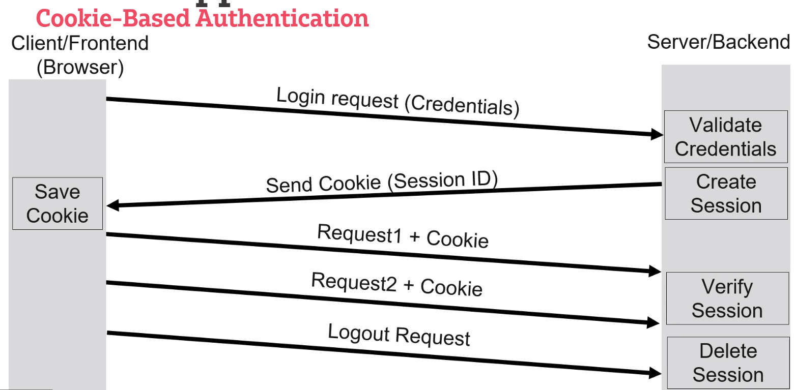
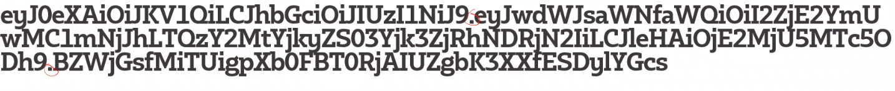
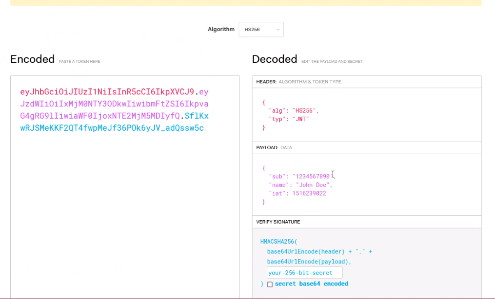
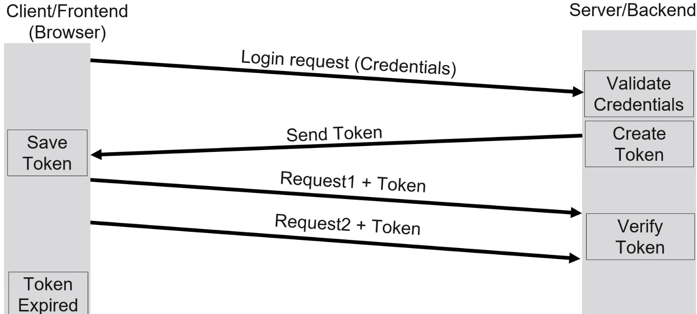
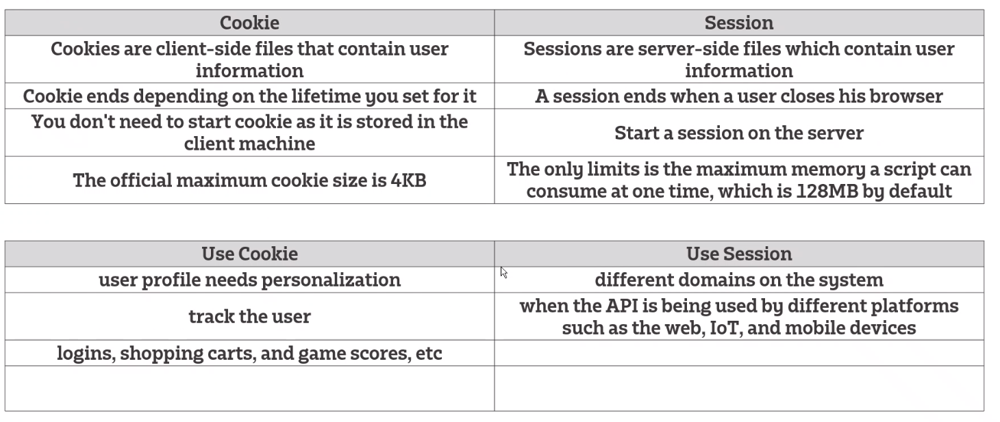

# App Authentication 
  
    Will associate an incoming request HTTP request with a set of credentials identifying

### Cookie based authentication
  * A small piece of data that is created by a server and sent to your browsers when you are visiting the website
  * Browsers often need to store and sent it back to the server to tell that the request is comoing rom the same browers.
  * Will keep the user authenticated 
  * We read the cookie as a key "value pair"

  - It will cause the app to become Stateful (meaning it will continually talk to the same server
  - Cookies are normally minimal size meaning they can't hold much data for the user
  - They only work on a single domain, cannot be transferred through domains/sub-domain

### Token based authentication 
    A token is used to the user's state on the client machine.
  * JSON Web Token (JWT) is an open standard that is a way to securely transmit information between clients as a sever as a JSON
  * Consists of three parts separated by (.)
  * Header.Payload.signature
  
  * KWT header is baser 64 URL-encoded
  * Payload contains info on user accounts 

    
  - will still be a stateless session and can communicate with any server without having to re-authenticate 
  - Token can be bigger then a cookie depending on the amount of information in the payload 

### Cookie-based vs Token-Based

| **Cookie-Based**                                              | **Token-Based**                                                                                             |
|---------------------------------------------------------------|-------------------------------------------------------------------------------------------------------------|
| cookie is stored on the client but is connected to the server | token is only on the client                                                                                 |
| cookie can only hold a max of 4kb                             | token can hold as much data as you like                                                                     |
| personalisation/tracker of the user you will use cookies      | token is more usable for different platforms it doesn't need a browser (IOT devices authenticating access ) |
| both can be used at the same time for separate purposes       |                                                                                                             |

# Useful sites
https://jwt.io/

### Cookie/Token References

https://www.section.io/engineering-education/cookie-vs-token-authentication/

https://wp-rocket.me/blog/difference-json-web-tokens-vs-session-cookies/

https://dev.to/dev_emmy/what-is-really-the-difference-between-cookie-session-and-tokens-when-it-comes-to-authentication-4164

https://hackernoon.com/using-session-cookies-vs-jwt-for-authentication-sd2v3vci

https://jwt.io/

https://www.guru99.com/difference-between-cookie-session.html