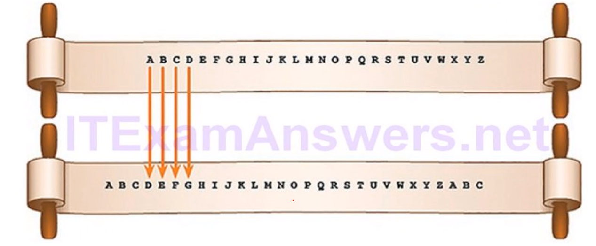
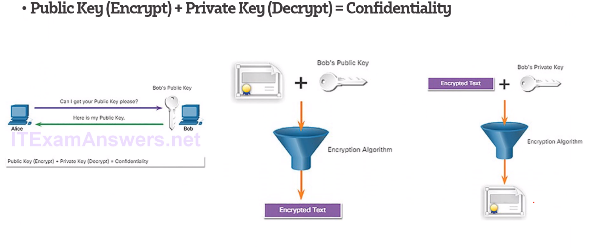

# Cryptography

## Essentials

* Encryption
    
  
    Encryption is a process which transforms the *original* information into an unrecognisable form of data 

* Decryption

  
    A process of converting encoded/encrypted data in a form that is readable and understood by a human or a computer

## Ciphers 

### Substitution cipher
Has a method, and a key for example below the key is 3, and the method is move along the alphabet by the number of the key
* Caesar Cipher

### Transposition Cipher
* No letter are replaces
* The letters are rearranged

## Encryption Classes

### Symmetric encryption algorithms
        Encryption algoriths that use the same key to encrypt and decrypt data
        Uses less computer resources then Asymmetric
* pre shared key that is different for every communication 

  1. Block Cipher
        * Takes the entire block of plain text and runs the encryption on the entire block i.e 64 bit blocks
        * Will pad the data if it isn't enough for 64 bits
    2. Stream Cipher 
        * Encrypts one bit at a time
        * Better to be used for things like streaming

## Asymmetric encryption algorithms
    Encryption algorithms that usse different keys to encrypt and decrypt data
    Either Public or Private can be used for encryption and decryption

 ### Confidentiality
* Public key(Encrypt) + Private Kay(Decrypt) = Confidentiality 

### Authentication
When you encrypt the message with the private key the receiver can be sure that it has come from the correct user as only they will  have the private key 
Integrity of the message is solid as no one can change it and re-encrypted it. 

## Diffie-Hellman
* An asymmetric mathematical algorithm
* Allows two computers to generate an identical shared secret without having communicated before
* The new shared key is never actually exchanged between the sender and receiver 
i.e Used in IPSec protocol
  
### Protocols that use Asymmetric

## Difference between Symmetric & Asymmetric 

# Online tools

https://www.dcode.fr/caesar-cipher

https://www.dcode.fr/substitution-cipher

https://www.dcode.fr/transposition-cipher

https://www.devglan.com/online-tools/aes-encryption-decryption

https://www.youtube.com/watch?v=gP4PqVGudtg

https://asecuritysite.com/encryption/diffie

# References

1. https://www.kaspersky.com/resource-center/definitions/what-is-cryptography
2. https://www.guru99.com/difference-encryption-decryption.html 
3. https://itexamanswers.net/ccna-cyber-ops-version-1-1-chapter-9-cryptography-and-the-public-key-infrastructure.html
4. https://itexamanswers.net/cyberops-associate-module-21-cryptography.html
5. https://www.thesslstore.com/blog/difference-encryption-hashing-salting/ 
6. https://itexamanswers.net/ccna-security-2-0-study-material-chapter-7-cryptographic-systems.html