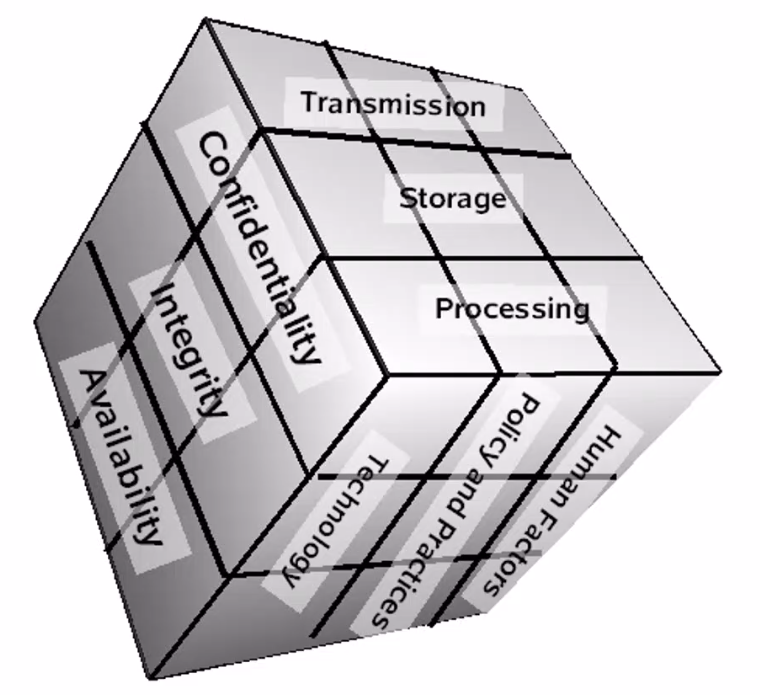
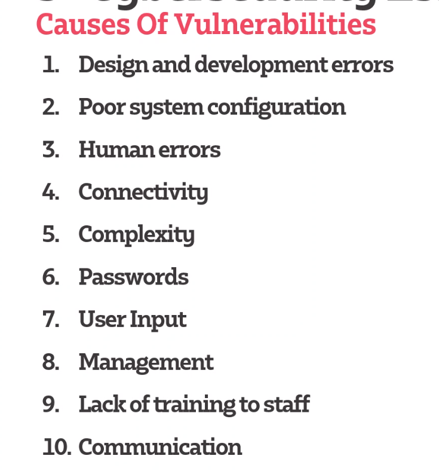
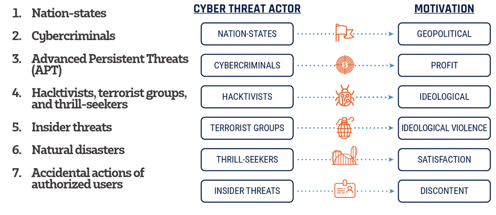
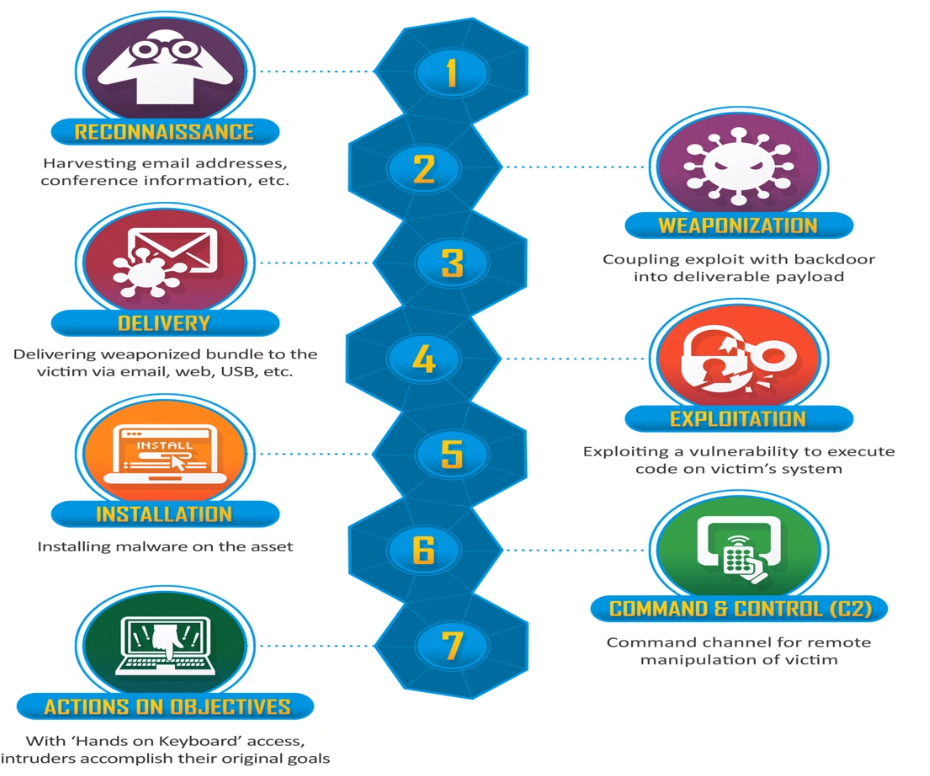

# Cyber Basics

## Cybersecurity Cube (McCumber Cube)

    A model framework for establishing and evaluation information secuirty programs
### 1. Desired goals
   * Confidentiality
        * Unauthorised access is prevented 
   * Integrity
        * Data should not be modified
    * Availability
        * Access should not be unavailable 
### 2. Data States
   * Transmission
        * Transferring data between information systems known as DIT (Data in Transit)
    * Storage DAR(Data at risk)
        * In an information system such as that stored in memory, or a hard drive  
    * Processing 
### 3. Safeguards
    * Humans Factors
        * Personnel
    * Policy and practices
       * Admin controls 
    * Technology 
        * Software and hardware based solution

## Terms
    CVE - Command vulnerability expose
    CVSS - Command vulnerability scoring system 
1. Asset
   * An asset is what you are trying to protect
2. Vulnerability 
   * A weakness or gap in our protection efforts
3. Exploit
   * The way a hacker leverage vulnerabilities
4. Threat
   * What we are trying to protect against
5. Risk
    * The intersection of asserts, threats and vulnerabilities
    * How bad it is if it was to happen 
    
## Casuses of Vulnerabilities 

## Cyber threat Actors 

## Cyber threats 
1.Malware
   * Does a malicious task on a device, or a network
2.Spyware
     * A form of malware that hides on a devices and provides real-time information 
3.Phishing attacks
       * Is when a cybercriminal attempts to lure individuals into providing sensitive data
4.Distributed Denial of Service (DDoS) attacks
   * Aim to disrupt a computer network by flooding the network with superfluous requests
5.Ransomware
     * Type of malware that denies access to a computer system or data until a ransom is paid
6. Zero-day Exploits
   * Is a flaw in the software, hardware or firmware this is unknown to the party responsible for patching the flaw 
7. Advanced persistent threats
   * Gain access to a device or network and stays there without being detected for a period of time
8. Trojans
   * Is a backdoor in your system
9.Wiper Attacks
     * Is a form of malware whose intention is to wipe the hard drive
10.Intellectual property theft
       * stealing or using someone else's intellectual property without permission
11.Theft of money
         * Stealing bank account info
12.Data manipulation 
           * doesn't delete data but aims to change it
13. Data destruction 
14.Man-In-The-Middle
    * Relays and possibly alter the communication between two parties 
15. Rogue software
   * Malware that is disguised as real software 
16. Unpatched software
    * unpatched software is a software that has a known security weakness
17.Data Centre disrupted by natural disaster
18. Water holing
    * Setting up fake websites or compromising legit ones in order exploit visitors
19. Spear-Phishing 
20. Deploying a botnet
21. Subverting the supply chain

## Cyber threat surfaces
   
      All the available endpoints that a threat actor may attempt to exploit in Internet-connected devices
      Services, devices, and data can all be targeted
      
## Cyber Kill Chain

8. Retreat
   * Deleting any trace of the attacks existence 
    

# Reference

1. https://en.wikipedia.org/wiki/McCumber_cube 
2. https://btu.edu.eg/wp-content/uploads/2020/03/Chapter-2-The-Cybersecurity-Cube.pdf 
3. https://analyticsindiamag.com/decoding-cyber-basics-threat-vulnerability-exploit-risk/ 
4. https://www.compuquip.com/blog/cybersecurity-threats-vulnerabilities
5. https://www.icann.org/news/blog/threats-vulnerabilities-and-exploits-oh-my 
6. https://cyber.gc.ca/en/guidance/cyber-threat-and-cyber-threat-actors 
7. https://www.ncsc.gov.uk/information/how-cyber-attacks-work 
8. https://www.threatanalysis.com/2010/05/03/threat-vulnerability-risk-commonly-mixed-up-terms/ 
9. https://www.upguard.com/blog/cyber-threat 
10. https://www.bulletproof.co.uk/blog/what-is-the-cyber-kill-chain 
11. https://secureteam.co.uk/articles/information-assurance/what-is-the-cyber-kill-chain/ 
12. https://www.softwaretestinghelp.com/penetration-testing-guide/