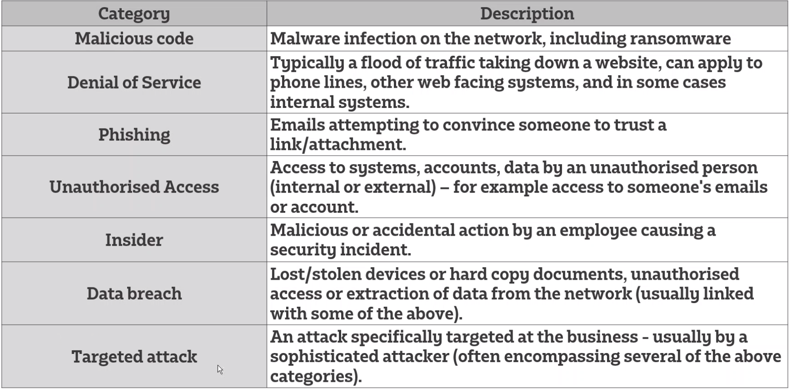
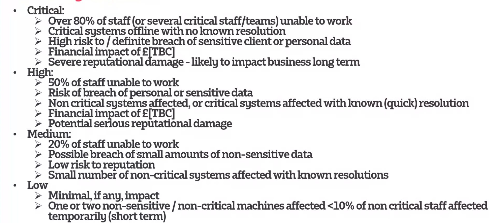

# Digital forensics and Incident Response 

Incident Response (IR):

`A structured methodology for handling secuirty incidents, breaches and cyber threats`

A well-defined incident response plan(IRP)

`Allows you to effectively identify minimize the damage, and reduce the cost of a cyber attack, while finding and fixing teh cause to prevent future attacks`

## Incident Categorisation

## Severity matrix

## IR steps

### Preparation
- Has everyone been trained on security policies?
- Have your security policies and incident response plan been approved by appropriate management?
- Does the IR team know their roles, and the required notification to make?
- Have all IR team members participated in mock drills?

### Identification
- When did the event happen?
- How was it discovered?
- Who discovered it?
- Have any other area been impacted?
- What is the scope of the compromise?
- Does it affect operations?
- Has the point of entry of the event been discovered ?
### Containment
- What has been done to contain the breach short and long term?
- Has any discovered malware been quarantined from the rest of the environment?
- What sort of backups is in place?
- Does your remote access require true multi-factor authentication ?
### Eradication
- Have artifacts/malware from the attacker been securely remote?
- Has the system be hardened, patched, and updates applied?
- Can the system be re-imaged
### Recovery
- When can systems be returned to production
- Have system been patched, hardened and tested
- Can the system be restored from a trusted back-up
- How long will the affected systems be monitored and what will you look for when monitoring

### Post-incident Activity
- What changes need to be made to the security?
- How should employee be trained differently?
- What weakness did the breach exploit?

- Emergency contacts
- At least one conference number
- Escalation criteria
- System backup and recovery processes list
- Forensics analysis list
- Jumpbag list
    `List of items & process that you will need during an incident`
- Security policy review list

## Playbooks 
` A playbook/runbook is a detailed response plan, usually focused on a specific incident type`
- Malware Outbreak: https://www.incidentresponse.com/playbooks/malware-outbreak 
- Phishing: https://www.incidentresponse.com/playbooks/phishing 
- Data Theft: https://www.incidentresponse.com/playbooks/data-theft 
- Virus Outbreak: https://www.incidentresponse.com/playbooks/virus-outbreak 
- DDoS: https://www.incidentresponse.com/playbooks/ddos 
- Unauthorised Access: https://www.incidentresponse.com/playbooks/unauthorized-access 
- Elevation of Privilege: https://www.incidentresponse.com/playbooks/elevation-of-privilege 
- Root Access: https://www.incidentresponse.com/playbooks/root-access 
- Improper Computer Usage: https://www.incidentresponse.com/playbooks/improper-computer-usage

# Digital Forensics

## Computer forensics
`Originally digital forensics was used as the synonym for computer forensics`
- Computer systems
- Embedded systems 
- Any static memory (USB)
## Mobile Device forensics
`Coollect data from mobile devices`
- SMS (Short message servcies)
- Emails
- Data regarding location of teh user 
- Call logs
- User dictionary content
- Data from installed applications 
- System files
- Usage logs
- Any deleted data 
## Network Forensics
`Involes capturing and analysing network traffic and network packets over a local and wide area naetwork (internet). Also covers intrusion detection`
- Uses two systems to collect data:
    - Catch-it-as-you-can 
    - Stop,Look, and listen
    
## Database Forensics
`The forensic study of databases and its metadata falls under databse forensics`

Database forensics investigator analyses:
    - Database content
    - Log file
    - In Ram data recover pieces of digital evidence or to build a timeline for the incident
## Forensics Data Analysis
` Covers investigation of financial crimes associated with structured data. Main motive is to find a pattern behind the fraudulent tansaction`
## Email forensics
- Email Header Analysis
    - Basic information for the email
- Email server investigation
- Investigation of network devices
- Sender Mailer Fingerprints
- Software embedded identifiers 
- Bait Tactics
    - Sending a bait email
    
## Cloud Forensics
`Digital forensics in cloud computing, it is a subnet of network forensics. Used to agther evidence in a way that is suitable for presenation in court of law`

Contains various cloud actors:
    - Cloud providers
    - Cloud consumer
    - Cloud broker
    - Cloud carrier
    - Cloud Auditors

# Digital Forensics phases
- Phase 1 - First response
    - Can minimise the damage to a network if completed correctly
- Phase 2 - Search and seizure
- Phase 3 - Collect the evidence
- Phase 4 - Secure teh evidence
- Phase 5 - Data Acquisition
- Phase 6 - Data Analysis
- Phase 7 - Evidence assessment 
- Phase 8 - Documentation and reporting
- Phase 9 - Testify as an expert witness 
    
# References 
https://www.exabeam.com/incident-response/steps/

https://www.securitymetrics.com/blog/6-phases-incident-response-plan

https://www.securitymetrics.com/blog/5-things-your-incident-response-plan-needs

https://www.ncsc.gov.uk/collection/incident-management/cyber-incident-response-processes

https://blog.eccouncil.org/digital-forensics-new-age-forensic-science/

https://www.stellarinfo.com/blog/email-forensics-investigation-guide-for-security-experts/

https://kumarshivam-66534.medium.com/cloud-forensics-be18e14230de

https://blog.eccouncil.org/9-phases-of-digital-forensics-part-i/

https://blog.eccouncil.org/9-phases-of-digital-forensics-part-ii/

https://www.eccouncil.org/what-is-digital-forensics/