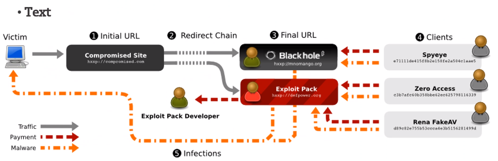

# Exploitation

`Using a vulnerabilities to run a exploit to complete an unexpected event that is unknow by the developer `

## Exploit Categories
- Known

`They are known to the system or software developers`
- Unknown 

`They are no documentations of this or any current solution, or we know of it but there is no fix for it`

## Exploit Naming
- The type of vulnerability they exploit (such as BOF or Dangling pointer)
- Local (Has to be run from the machine locally) 
- Remote ( can be run remotely )
- Can also be the result of running the exploit (DoS, spoofing, or privilege escalation)

## Exploit Types
- Null or Default Password
    - Normally on network devices
    - In many legacies operating system
    - Admins create a privileged user account in a rush and leave the password as null
    - Wireless access points and preconfigured secure server appliances 
- Network exploits
    - IP spoofing 
    - Man-in-the-middle
    - Firewall Traversal
    - ARP poisoning 
    - WLAN
- Eavesdropping
    `Collecting the traffic (not changing it in any way)`
    - Works mainly with plain text transmission 
    - Remote attack must hae access to a compromised system
    - ** Prevent it by using cryptography**
- Service Vulnerabilities
    - HTTP-based services are vulnerable to remote command attacks
    - Services that have vulnerabilities, i.e Buffer overflows
    - **Prevents admins shouldn't run the services as root** 
    
    - Web servers exploits:
  
            - Session Hijacking
                - Stealing session cookie to take over your internet session as you 
            - SQL injection
            - Directory Traversal
                - Finind hidden files on a server
            - Code Injection
            - Cross-site Scripting
                - Injecting a script into the server/brower
    
- Host-based Vulnerability
    - Workstations and desktops are more prone to exploitations
    - Safeguards can be implemented such that email client software does not automatically open or execute attachments
    - **Automatic updates**
- DoS attack (Denial of service)
    - Ping flood attack 
    - **Use an IDS/IPS/IDP using an iptable and network IDsec**

## Exploit kits

`Exploit kits are tools embedded in compromised web pages.
They automatically scan a visitors machine for vulnerabilities and attempt to exploit them.
If successful it will inject malware to the user's system`
  

- Examples
    - RIG EK
    - GrandSoft
    - Magnitude
    - Nuclear
    - Neutrino

## Exploit Databases

- https://www.exploit-db.com
- https://www.rapid7.com/db/
- https://cxsecurity.com/exploit/
- https://www.vulnerability-lab.com/
- https://0day.today
- https://www.securityfocus.com/vulnerabilities
- https://packetstormsecurity.com/files/tags/exploit/
- https://www.exploit-db.com/google-hacking-database
- https://attack.mitre.org/techniques/enterprise/

## Exploit Labs