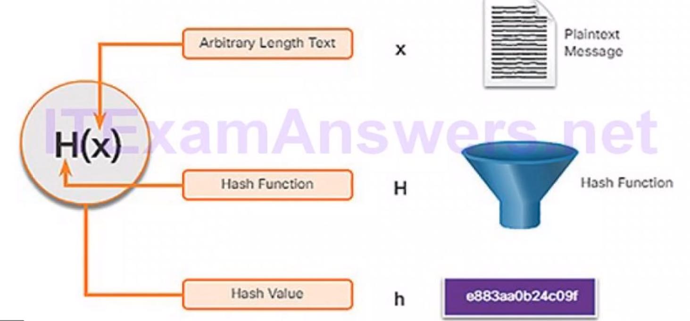
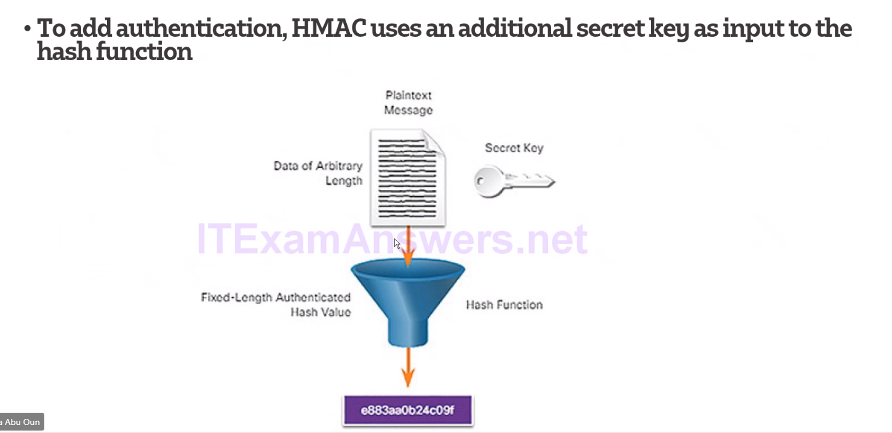
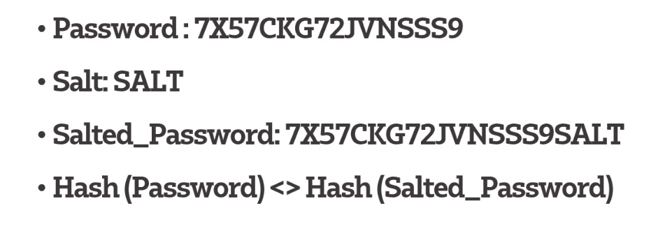

# Cryptographic Hash Operation

* Used for data integrity
* Based on a one-way mathematical function that is relatively easy to compute, but harder to reverse 
* can be used to ensure Authentication

  

## Known Hash functions

1. MD5 (Message digest)
   * Uses 128 bit digest one way function
2. SHA-1 (Secure Hash algorithm)
   * Similar to MD5
3. SHA-2 
    * 224 bit,256 bit,384 bit,512 bits  
    
## Hash message authentication code (HMAC)-1
    HMAC uses an additional secret key input to the hash function to include Authentication

## Password Salting

    Salt is a unique value that can be added to the end of the password to create a different hash value 
*Exmaple*
