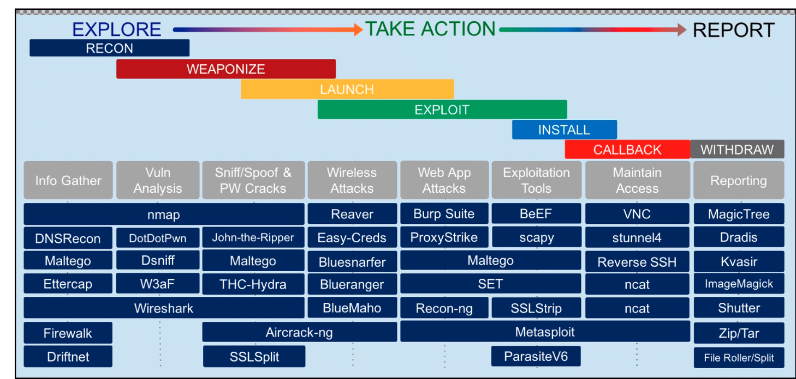

# **PenTesting**

    Is: A method for gaining assurance in the security of an IT system
    By: Attempting to breach some or all of that system's secuirty
    Using: The same tools and techniques
    As: An adversary might 
    The end result will be to find the vulnerbilities and bugs in your secuirty before the hackers can figure it out

- PenTesting can be internal employees or 3rd party penetration testers
- Third party pentests should be performed by qualified and experienced staff only 
- By their nature, penetration tests cannot be entirely procedural, and exhaustive set of test cases cannot be drawn up.
- Should be from a governing board such as CREST, Tiger scheme 

## Penetrating testing Objectives
- Vulnerability identification in bespoke or niche software 
- Scenario driven testing aimed at identifying vulnerabilities 
- Scenario driven testing of detection and response capability 

## Pentest scope
*Should give confidence in*:

    - Test has been configured in accordance with good practice
    - There are no commonly known vulnerabilities 
## Pentest Results

- Exactly what techniques are used, what targets are allowed 
- How much knowledge of the system is given to the testers
- How much knowledge is given to the sytem admin can vary within the same test regime 

## Start Points
- External Network Penetration test
    - An external network penetration test is typically what most people think of when talking about pen test
        - Good to figure out how your external facing network can handle with pen testing
- Internal Network Penetration Test
    - Simulates either the actions a hacker might take once access has been gained to a network
    - They are looking to escalate privilege
    ## *Methods/Targets*
- Physical Pen test
    - Building system and gaining access to the building 
    - Physical access to the servers and network room 
- Social Engineering
    - Manipulating human factors
    - Checking if your employees follow the security policy
- Web Application
    - Looks for any security issues that might come from insecure systems
- Client side 
- Cloud Penetration testing
    - You will need to inform the cloud providers before any tests can take place
    

## Blindness level 
- Targeted(Blindness)
    - Blue and Red team work together and both have full knowledge
- Blind
    - Given only the name of the Enterprise 
    - Blue team knows but Red team doesn't
- Double-blind
    - Both sides have no information about what is going on 
    - Most real situation 

## CyberSecurity Colours

### *Blue Team* (The Defenders):
* They are responsible for implementing defensive security, damage control, and incident response 
### *Red Teams* (The Breakers/Attackers):
* They are the team commission to perform "ethical hacking" on an organisation
### *White team* (The Admin):
* The group is responsible for refereeing an engagement between a Red team of mock attackers and Blue Team of actual defenders of their enterprise's use of information system 
### *Yellow Teams* (The Builders):
* This is the team responsible for developing the security system of an organisation 

## Hacker colours
    Someone that gain access to/changes the content of files/systems without granted permission 

### *Black Hat Hackers*
- Attackers
- Personal/financial motivation
- Usually illegal fighting against the law 
* Will look for vulnerabilities without permission  
### *White Hat Hackers*
* Using their pentesting knowledge for the good of a company
* Usually helps defend a network
### *Grey Hat Hackers*
* Between the black and white hat hackers
* Will look for vulnerabilities without full permission but will report them to owner 
* Do not have malicious intentions 

## Testing colours

### Whitebox
- User has full knowledge of the system that they are testing 
- Normally done by internal staff 
### Blackbox
- Testing has no knowledge of the system at all
- Most realistic type of tests (closest to real hack) 
### Greybox
- The attacker will have partial knowledge of the system but doesn't have everything 

## PenTesting phrases 
1. Pre-Engagements Interactions

`Both parties have a full undersatnding what the target scope is and what can and cannot be done during the test `
2. Reconnaissance

`To gain a much knowldge of the target as possible`
3. Scanning

` First point of conntect with the target, you shoudl know the open ports, services running`
4. Threat Modelling 

`Will put the knowledge found in the recon and scanning phase together to plan out what vulnerbilities could be used` 

5. Exploitation

`Will start testing different exploits can be used in the system from what you have learned`
6. Foothold Installation

` To gain and maintain access in a system`

7. Analysis and Reporting

` Make sure to track everythign that has been doen during teh etst so that you can write a report of exactly has happened`
8. Clean Up and Remediation 

` Clearing anything that got changed during the test, and deleting any files that was craeted `

# References 

https://www.ncsc.gov.uk/guidance/penetration-testing

https://ww1.medium.com/colorful-cybersecurity-know-what-red-blue-and-yellow-mean-6a895865fd5

https://www.tripwire.com/state-of-security/security-data-protection/cyber-security/the-evolution-of-hacking/

https://us.norton.com/internetsecurity-emerging-threats-what-is-the-difference-between-black-white-and-grey-hat-hackers.html

https://csrc.nist.gov/glossary/term/White_Team

https://comtact.co.uk/blog/types-of-penetration-test-whats-the-difference/

https://cipher.com/blog/the-types-of-pentests-you-must-know-about/

https://www.techbeamers.com/penetration-test-and-types/

https://purplesec.us/types-penetration-testing/

https://www.imperva.com/learn/application-security/penetration-testing/

https://www.ncsc.gov.uk/information/check-penetration-testing

https://www.coresecurity.com/blog/six-stages-penetration-testing

https://www.freecodecamp.org/news/ethical-hacking-lifecycle-five-stages-of-a-penetration-test/

https://cipher.com/blog/a-complete-guide-to-the-phases-of-penetration-testing/

https://cyberx.tech/penetration-testing-phases