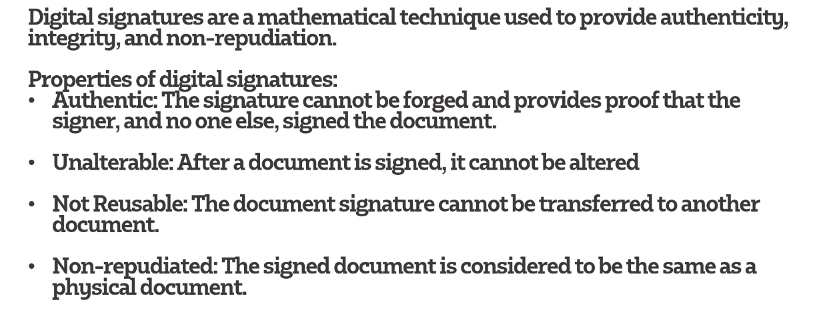
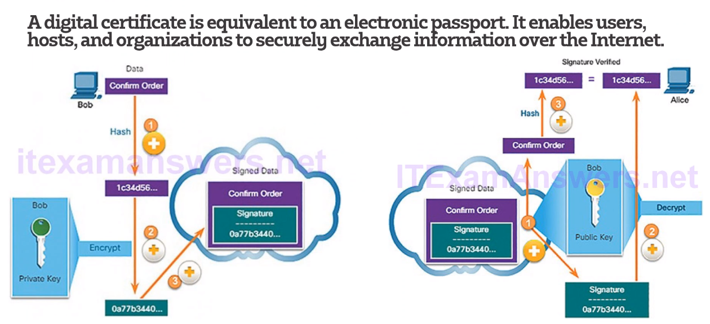
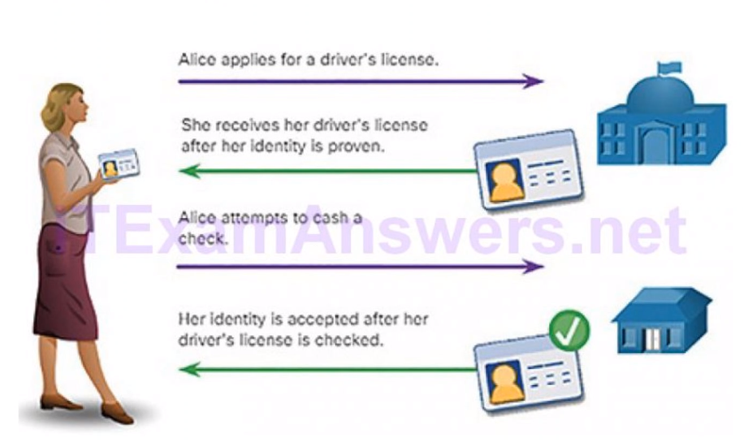
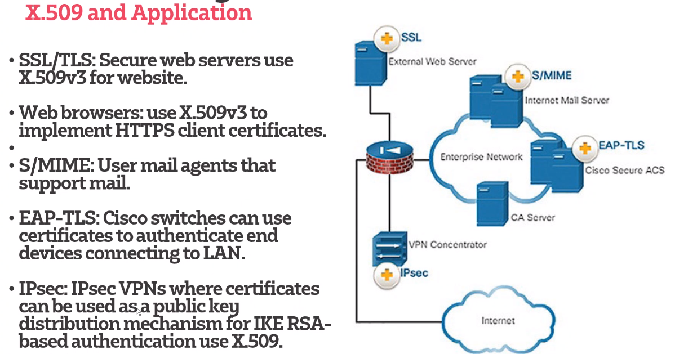
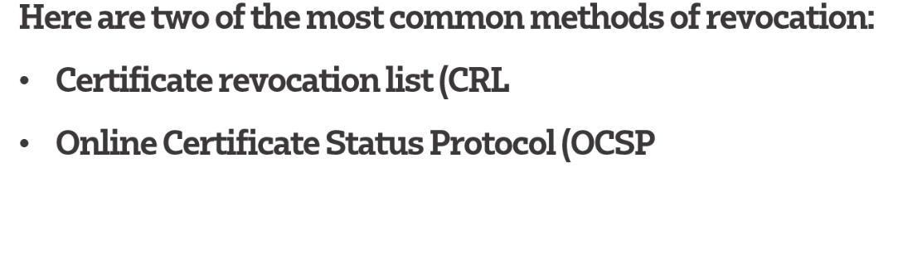

# Digital Signature

## Digital Signature (DSA) 
## Rivet-Shamir Adleman Algorithm (RSA)
## Elliptic Curve Digital Signature Algorithm (ECDSA)

## Code signing
    Digital signatures are commonly used to provide assurance of the authenticity and integrity of sofwtare code
* The codes authentic and is actually sourced by the publisher
* Hasn't been modified

### Public key Management

## Different types of revocation 
