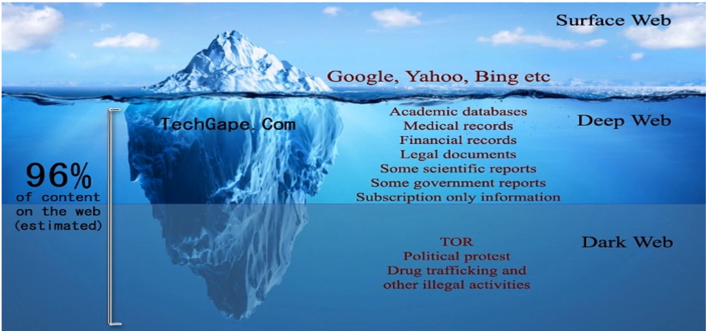
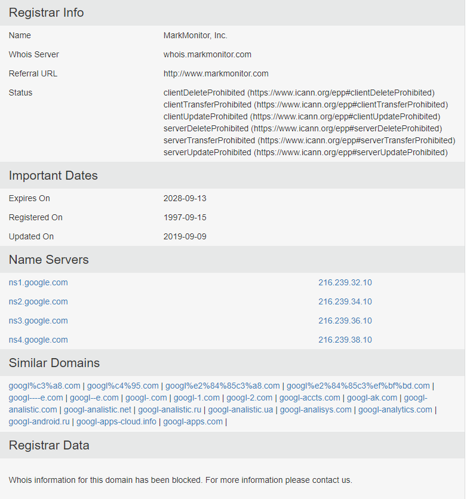

# Reconnaissance & Footprinting

    The process of collecting as much information as possible about the target system to find ways to 
    penetrate into the system. i.e finding about the staff members of the target compnay, keeping track of all the changes
*Footprinting helps to:*
* Know Security Posture i.e Know what they have such as firewall, or using vpn for employers 
* Reduce attack area
* Identify Vulnerabilities i.e knowing what is used in the target company
* Draw Network Map

## OSINT (open source intelligence )

* OSINT can be used for:
    * basic knowledge, business and public
    * Cyber professionals i.e Cyber Defence, Pentesters, Security Analysts, Cybercrime groups

### _OSINTS tools categorises_
* Domain and IP search
* Exposed data on the enterprise websites
* Exposed data already on the internet
* Hidden data in files
* Connected devices search 
### _OSINT tools_
Domain Info
* WHOIS
    * https://www.who.is
      
    * Collects a wide range of information on a website such as domain name, owners, and ip address
    * Other sites. https://lookup.icann.org/ , http://centralops.net/co/ , https://whois.domaintools.com/
* Finding DNS information
    * DNSRecon (python script)

Google hacking and Dorking
* operator_name:keyword
   * _exmaples_:  intitle:     inurl:     intext:     define:     site:     phonebook:     maps:     book:     info:     movie:     weather:     related:     link:
    
    https://exposingtheinvisible.org/guides/google-dorking/

## Useful websites
* https://github.com/laramies/theHarvester
    * Used to gather information about staff, and domains  

* https://www.dshield.org

* https://www.virustotal.com/
    *  used to check files or websites for malicious content

* _https://github.com/ElevenPaths/FOCA_
    
    * Used to extract meta-data off public documents

Shodan.io
  * Searches the internet for IoT devices

Wappalyzer
* Brower extenstion used to find information on a website

https://crt.sh/
* Enter an Identity (Domain Name, Organization Name, etc),
a Certificate Fingerprint (SHA-1 or SHA-256) or a crt.sh ID

https://github.com/aboul3la/Sublist3r

https://osintframework.com/

WayBackmachine
* Will show you older versions of the website 
