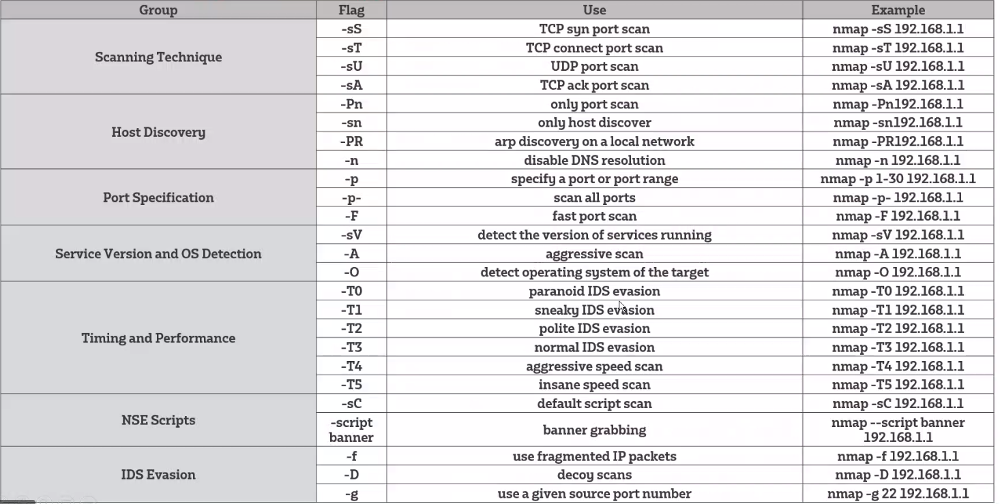

# Scanning 

    Scanning which is part of the kill chain is considered as footprinting. 
    a set of precedrue for identidying live hosts, ports and services, discovering operating system and architecture of target system,
    Identifying Vulnerabilities and threats in the newtork.

- It is different from recon due to the fact it requires actions to be taken towards the target enterprise via technical means
- IT requires legal preparation to make sure that all the intended actions are legal 

## Network Scanning
    The process of gathering information about a network to determine all active devices on it 
Categorises of network scans:
## - Passive scanning
- A passive scan silently analyses network traffic (packet sniffing) to identify endpoints and traffic patterns
- No risks of disrupting any services of adding more traffics to the network
- WireShark, TCPDump

**Limitations:**
- Devices or applications that never communicate over the network will not be noticed
- Infected systems intentionally distributing misinformation
- 

## - Active scanning 
       Active scanning works by sending test traffic into the network and querying individual endpoints
**- Levels of scanning:**
**1. Host scanning**
    - Detecting all active hosts on a network and mapping them to their IP
    - ARP scan
      
        `ARP request can be sent out to many IP addresses on Local Area Network (LAN) to determine which hosts are up`
    - ICMP (internet control message protocol) 
      
    `Echo(or ping) requests are used to detect if another host caan be reached
    Timestamp messaeg to dtermine latency
    Address mask request are intended to discover the subnet mask in use on the network`
**2. Port scanning**
`    - The process of sending packets to specific ports on a host and analysing the responses to learn details about the services that are running for potential vulnerabilities`
   - Tries to classify ports into Three designations:

- Open: `The destination responds`

     
- Closed: `The distination recievced the request but it responds with a reply indicating no services is listening`

- Filtered: `No reply is received (normally means blocked by firewall `

    - Port scanning Methodologies:
        - Vanilla: Scans all 65,535
        - Strobe: Only known services
        - Sweep: Scans same ports on several machines
    

- ** TCP Scanning**
  - SYN scans
  `Sends only a SYN packet to the server, If you get a SYN ACK back it is open`
  - ACK scan 
    `Used to probe the rules of the firewall `
  - TCP connect scan
    `Connects to a port using the entire TCP handshake` 
  - NULL, FIN and Xmas Scans
    `Sends a block of null bytes, Sends a FIN flag used to closed a connection, `
    - Closed ports: RST( or ICMP port unreachable) packet
    - Open/Filtered port: No response  
  - IDLE scan

- **UDP scanning** 

`        UDP scans send a UDP packet a various port on a target system`

**3. OS fingerprinting**

`OS fingerprinting is the process of determining the operating system used by a host on a network`
* Common techniques are based on analysing:
    - IP TTL values 
    - The IP DF(De fragment) Option
    - The IP TOS (Type of Service)
    - IP ID values (IPID sampling)
    - TCP Windows Size
    - TCP Options(TCP SYN & SYN+ACk packets)
    - Initial Sequence Number (ISN) Sampling
    - DHCP/ICMP/HTTP requests
    - 
        
## Hybrid Scanning

    A combination of active and passisve scanning at the same time, which gives a better overview of the process in the network and to stop cyber threats

  ### TCP handshake

### TCP packets 

# NMAP
