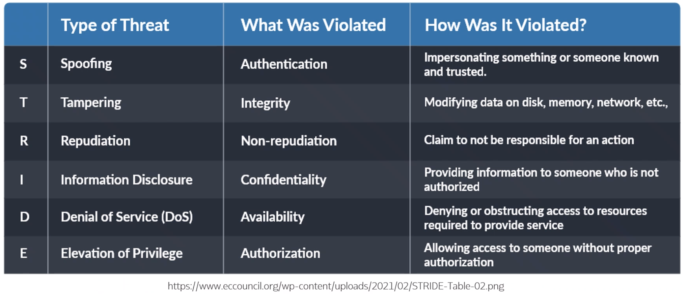
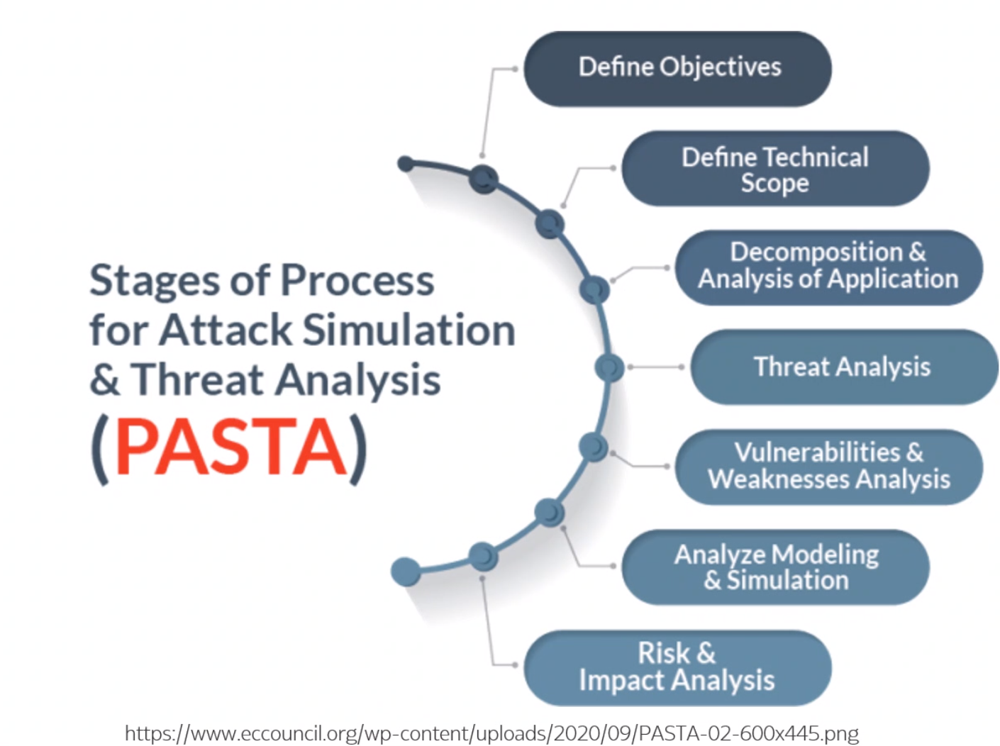
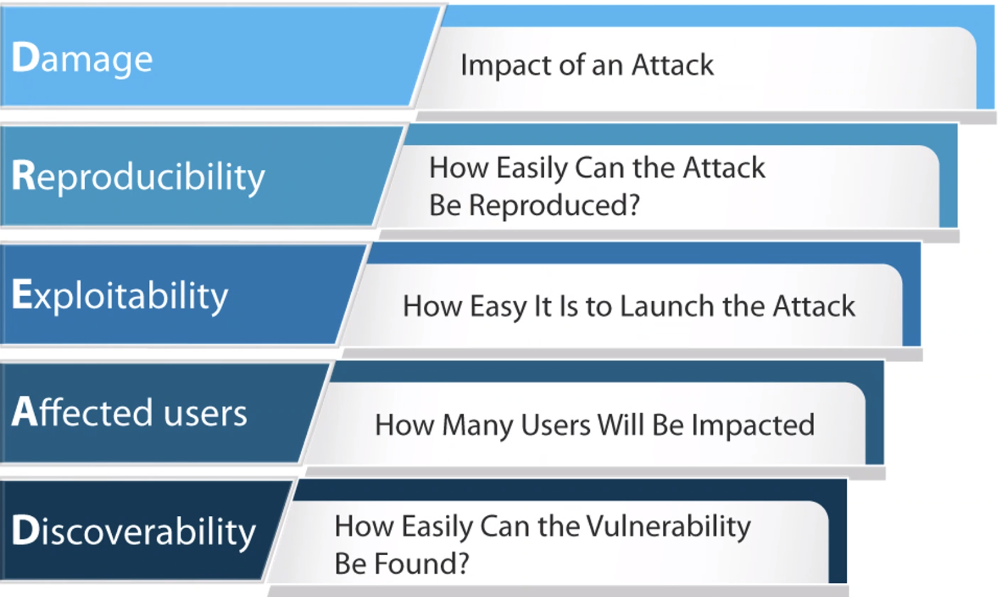

# Threat Modelling 
`Identifying what threats an organisation, a target network, or an in-scope application should be worried about`
* For pen testing:
    - Modeling (mapping out)
    - The treats (the things that can attack/harm)
    - To inform the types of activities conducted
    - And to inform the risk of the discovered vulnerabilities
    
* After Pen test:
    - Applying countermeasures and mitigating controls to address dangers
    
            Where am I most vulnerable?
            what are the most relevenaat threats?
            what do i need to do to safegaurd against these threats? 
    
## STRIDE 

`Focus more on the data itself`
## PASTA
`Process for attack simulation & threat analysis`

`Focuses more on the attack `
## DREAD
`Used to determine how surious the threat is`

# References
https://pentest-standard.readthedocs.io/en/latest/threat_modeling.html

https://www.diva-portal.org/smash/get/diva2:1517798/FULLTEXT01.pdf

https://www.triaxiomsecurity.com/2019/12/02/threat-modeling-for-penetration-testers/

https://www.tenable.com/blog/threat-modeling-what-you-need-to-know-about-prioritizing-attacks-and-vulnerabilities

https://www.eccouncil.org/threat-modeling/

https://blog.eccouncil.org/threat-modeling-methodologies-tools-and-processes/

https://cheatsheetseries