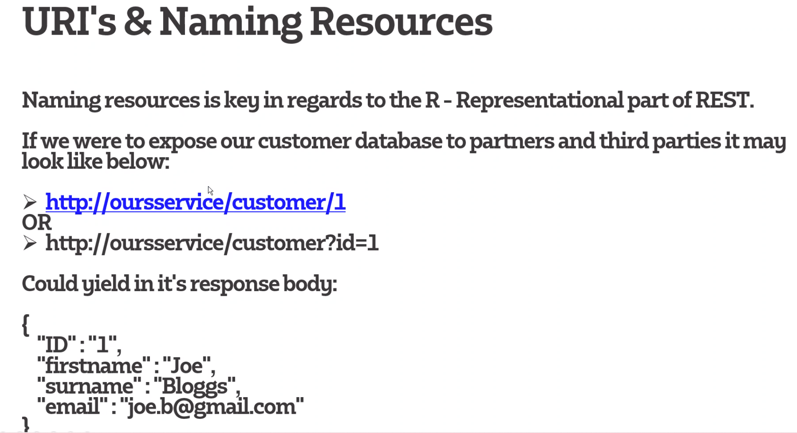

# REST APi
## _Representational State Transfer Application programming interface_

### What is it
        
    REST is a set of architectural constraints, it is not a protocol or a standard.
    When a client makes a request with RESTful API it transfers a representation of the state of the resource to the endpoint.
    This information, or representation, is delivered in one of several formats via HTTP: JSON (Javascript Object Notation), HTML, XLT, Python, PHP, or plain text

### REST properties 
* Representation and data flow
      
  
    Define your source data i.e JSON/XML
* Messages 
  
  
    HTTP, for any request you expect to receive a response back 
* URIs/Naming resources 
        
     
* Statelessness

    Means that your RESTful service does not maintain or hold the state of a previous request,
    meaning it will treat each call as a new request and handle it as it is brand new each time.
    Will most likily send the user to a new server each time a request is made.
    A statefule (Not used in RESTful API) will hold a session open for each person
* Caching 

**HTTP Verbs**

        * GET: Read
        * Post: Craete
        * PUT: Update/Replace
        * Patch: Update /MOdify
        * Delete : Delete  