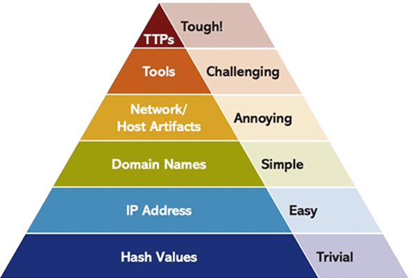
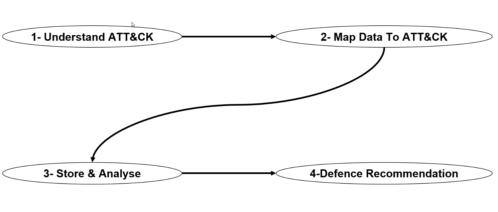
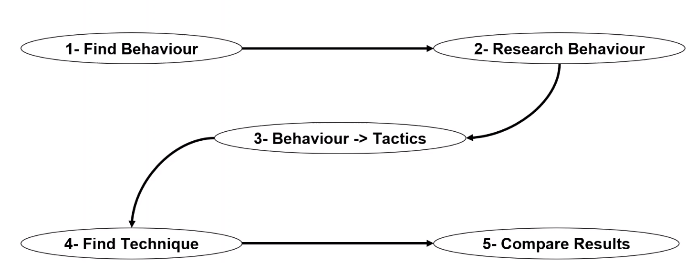
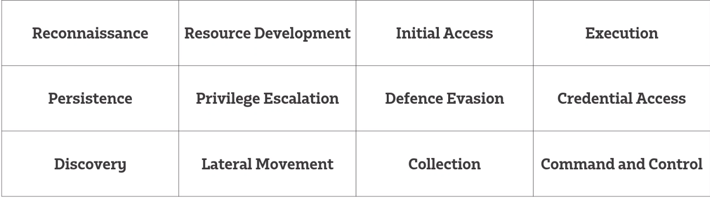
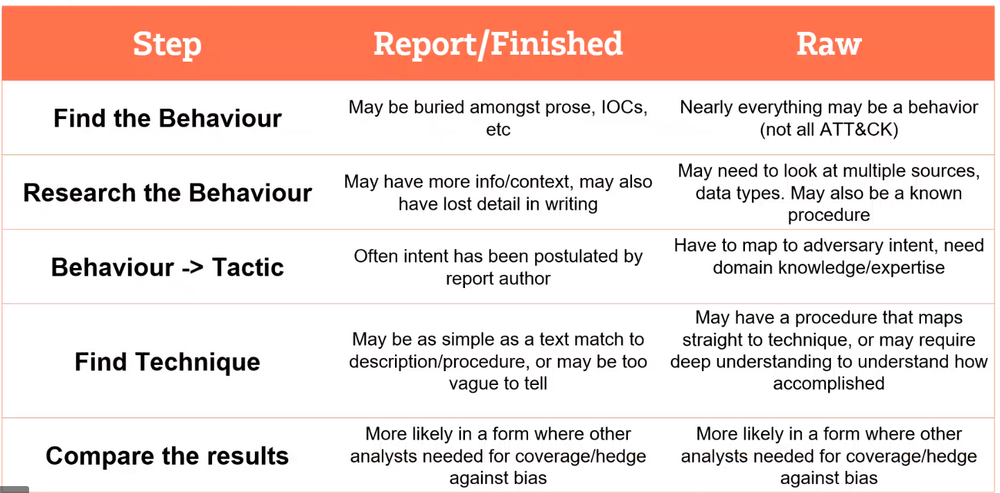

# Cyber Threat Intelligence (CTI)

## MITRE ATT&CK
`Adversarial Tactics, Techniques and common knowledge `
    
* it is a knowledge based on the attackers
* Based on real world observation
* Free open source 
* Focuses on Tactics, Techniques and procedures

## Mapping ATT&CK to CTI
`How to use ATT&ck in Cyber threat intellligence`

## Mapping to ATT&CK

1. Finding Behaviour
   * Check what adversary/software does
`   i.e This software does abc`
   * Analyse initial compromise and post-compromise
`    i.e Running commands, Creating a foothold/task, Establishing a connection/sending data`
2. Research Behaviour
    * Consult other teams (Red, Blue teams)
    * Search internet
    * Academic and security report
    `i.e Protocol, Port, Command`
3. Behaviour -> Tactics
   * What is the adversary trying to accomplish
    * 12 tactics 
4. Find Technique
   * A technique is a special behaviour to achieve a goal and is often a single step
    * A behaviour might not be a technique 
5. Compare Results
    * Analysts have bias
    * Different interpretation for analysing same situation/case
    * Discuss results
    
## Mapping to ATT&CK from raw data
1. Finding Behaviour
   * This time the behaviour will be found by anyalying data not reading a report 
2. Research Behaviour
   * May require expertise in specific domain
   `i.e Digital Forrensics, Specific OS/Network devices/data type`
   * May require multiple data sources or context
   * May require consulting/interviewing
3. Behaviour -> Tactics
   Same as from report
4. Find the Technique
   * Think of concurrent techniques
   i.e Data compression (Exfiltration) + Data Encryption (Exfiltration)
     Spear Phishing (Initial access)
     
5. Compare reults
   * Different interpretation for analysing same situation/case
   
# Mapping from Report vs From Raw Data

## Recommendationns 
1. Determine property techniques
   * What are the techniques that are priorities
2. Research how techniques are being used
3 Research defensive options relate to techniques
4 Research organisational capability/Constraints
5. Determine what tradeoffs are for the organisation on specific

# References 

https://www.youtube.com/watch?v=P0Fe2viJ508

https://attack.mitre.org/resources/training/cti/

https://attack.mitre.org/

https://attack.mitre.org/versions/v6/ -Older version 

https://github.com/mitre-attack/attack-navigator/ -Att&CK navigator 
