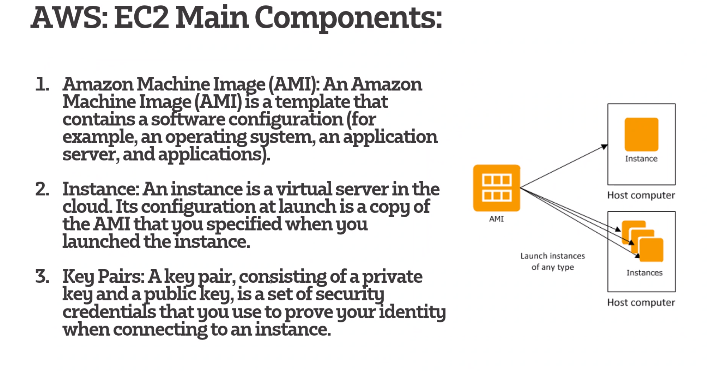
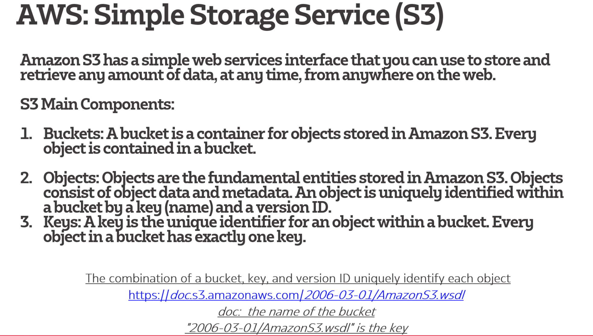
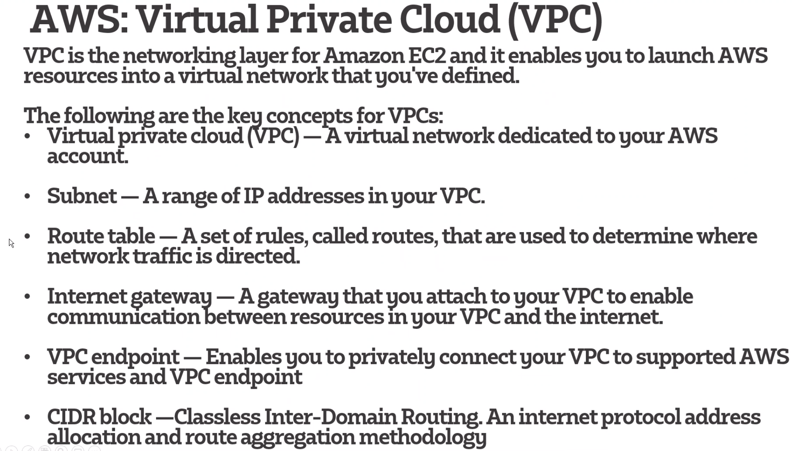

# Amazon Web Service

## EC2

## S3 (Simple Storage Service)

    Bucket contains objects and each object has a unique key

## VPC (Virtual Private Cloud )

## Security Group

    A security group acts as a virtual firewall for your EC2 instances to control incoming and outgoing traffic.

### *References*
https://aws.amazon.com/ec2/instance-types/