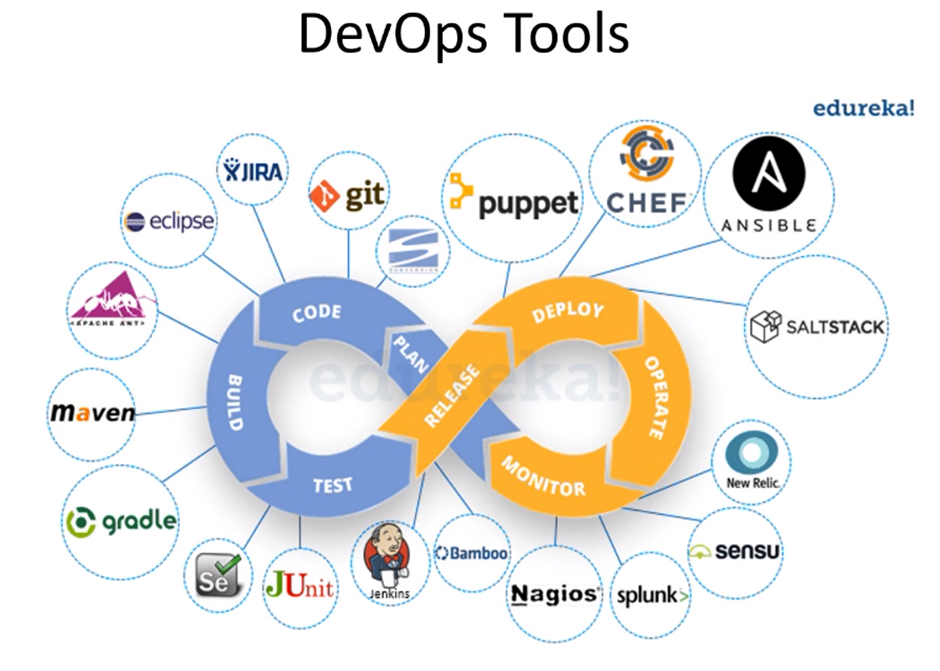
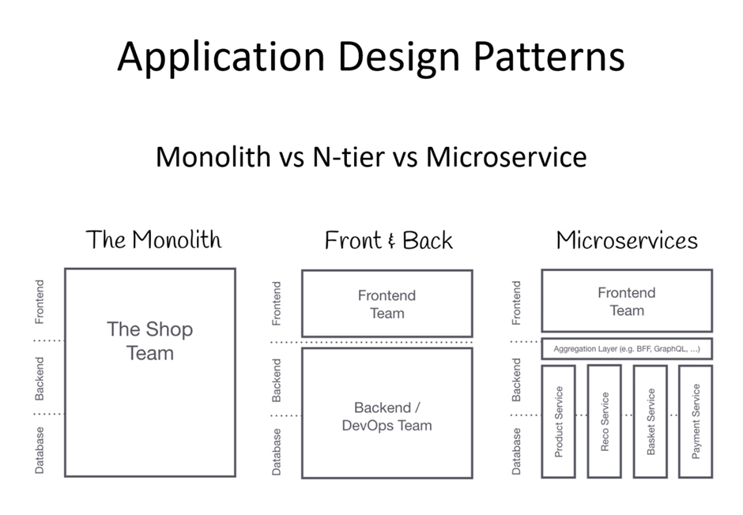
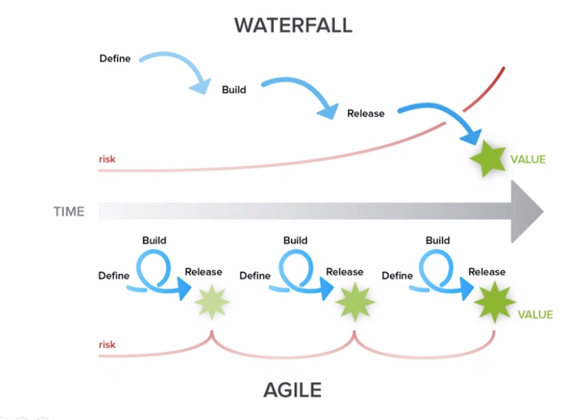
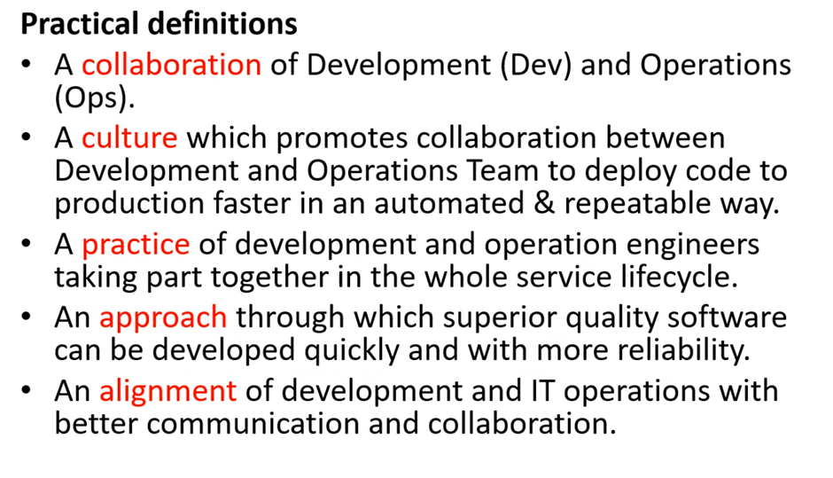
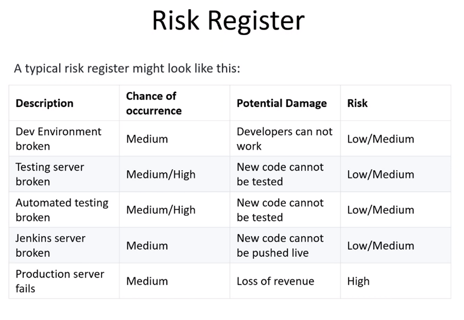
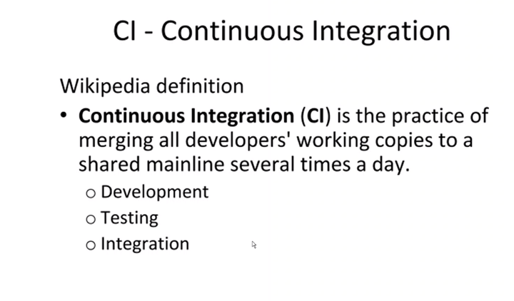
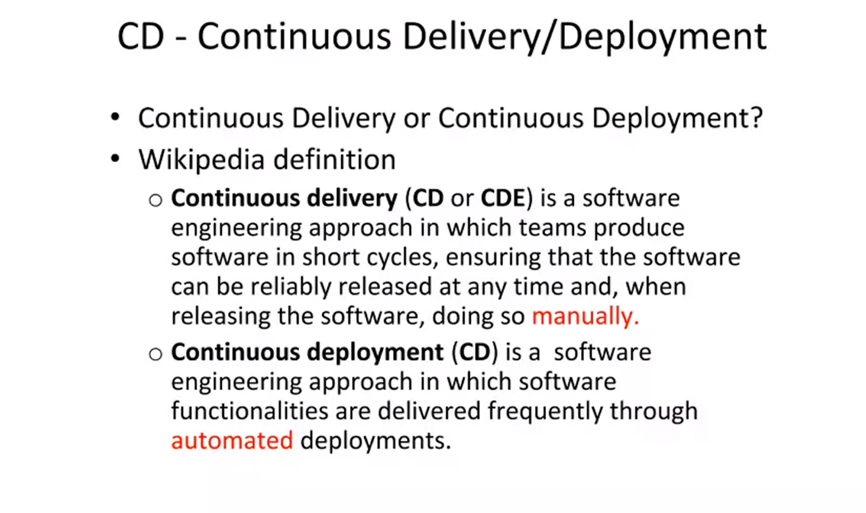

#What is DevOps

    DevOps is the combination of development and 
    operations. DevOps is a set of practices that 
    combines software development and IT operations. It 
    aims to shorten the systems development life cycle 
    and provide continuous delivery with high software 
    quality. DevOps is complementary with Agile software
    development; several DevOps aspects came from the 
    Agile methodology.

**DevOps Lifecycle**

* Continuous Development
* Continuous Testing
* Continuously testing the code for bugs
* Continuous Integration
* Continuous Deployment
* Deploying the software or the changes
* Continuous Monitoring

**The Monolith**

Does the entire project at the same time

**Front &amp; Back**

Separates the front and back end of the project

**Microservices**

    Separates the entire project into small 
    sections, completing and testing small sections 
    at a time. Can do different microservices of
    different servers. Can contain a number of 
    different functions, a good comparison of a
    microservices would be coding libraries. Allows
    for the reusability of tools in a projects.

**Challenges in New SDLC**

* Ease of use
* Flexibility
* Robustness
* Cost
 
**What is DevOps**

**DevOps Values CAMS (Culture, Automation, Measurement, Sharing) Model**

- Sharing
  - Ensure that there is a blame free environment to ensure the team are willing to share everything to make the project go smoothly
- Measurement
  - Monitoring and tracking the performance to ensure that the project doesn&#39;t repeat the same mistakes
- Automation
- Culture

**DevOps Principles**

1. Customer-Centric Action
2. End-to-End Responsibility
3. Continuous Improvement
4. Automate everything
    1. i.e Creating and destroying the infrastructure
5. Work as one team
6. Monitor and test everything

# **CI/CD**

Combination of **continuous integration** and either Continuous delivery or **Continuous deployment**. Where the aim is to automate as much as possible within the project. CI/CD is the 3rd /4th stage of the Development lifecycle.

_ **Why** _

* Reduce cost
* Faster release rate
* Smaller code changes
* Fault isolations
* More test reliability
* Increase team

 
_ **Continuous Delivery is manual** 
_ **Continuous Deployment is automated** 